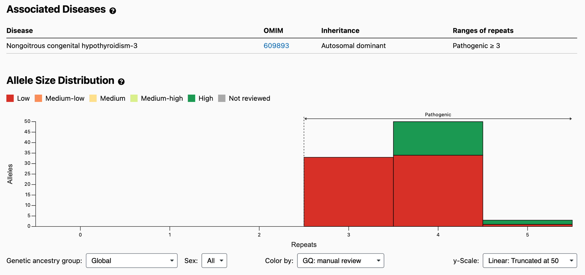
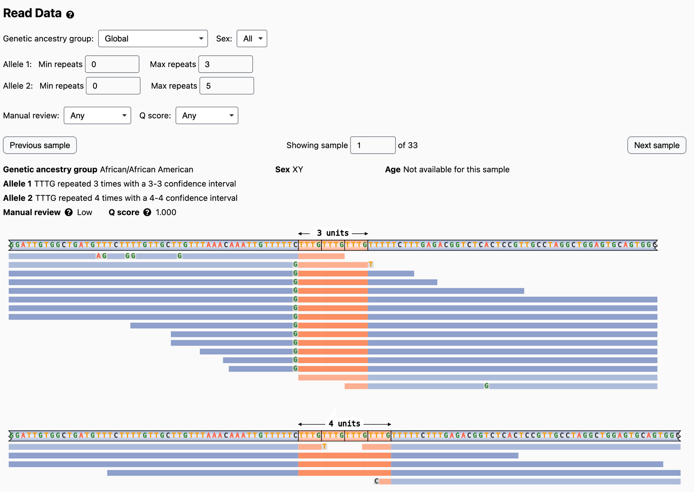

This minor update to the [gnomAD TR pages](https://gnomad.broadinstitute.org/short-tandem-repeats?dataset=gnomad_r4) includes:
- Added one more TR locus: [RAI1](https://strchive.org/loci/FAME8_RAI1), so there's now data for 78 total TR loci. Also added pathogenic thresholds for three loci that already had TR data but previously lacked a disease association: [AFF3](https://strchive.org/loci/FRA2A_AFF3) (300), [CBL](https://strchive.org/loci/JBS_CBL) (101), and [ZNF713](https://strchive.org/loci/FRA7A_ZNF713) (450) taken from [STRchive](https://strchive.org/) [v2.24.2](https://github.com/dashnowlab/STRchive/blob/main/CITATION.cff).

- Updated pathogenic thresholds for the following loci. These changes are primarily based on syncing thresholds with [STRchive](https://strchive.org/) [v2.24.2](https://github.com/dashnowlab/STRchive/blob/main/CITATION.cff), while taking into account some differences in how loci are defined in gnomAD vs. STRchive (for example, [RUNX2](https://strchive.org/loci/CCD_RUNX2) has a reference region that's narrower by three trinucleotide repeats in gnomAD compared to STRchive, so the pathogenic threshold is also reduced by three repeats in gnomAD):

  - [ATXN3](https://strchive.org/loci/SCA3_ATXN3) (CTG x 56 → 60)
  - [CACNA1A](https://strchive.org/loci/SCA6_CACNA1A) (CTG x 20 → 21)
  - [CNBP](https://strchive.org/loci/DM2_CNBP) (CAGG x 55 → 75)
  - [FXN](https://strchive.org/loci/FRDA_FXN) (GAA x 66 → 56)
  - [MARCHF6](https://strchive.org/loci/FAME3_MARCHF6) (ATTTT x 668 → 650)
  - [NOTCH2NLC](https://strchive.org/loci/NIID_NOTCH2NLC) (GGC x 90 → 66)
  - [PHOX2B](https://strchive.org/loci/CCHS_PHOX2B) (GCN x 24 → 26)
  - [RUNX2](https://strchive.org/loci/CCD_RUNX2) (GCN x 20 → 17)
  - [SAMD12](https://strchive.org/loci/FAME1_SAMD12) (AAAAT x 100 → 97)
  - [TBP](https://strchive.org/loci/SCA17_TBP) (GCA x 43 → 49)
  - [XYLT1](https://strchive.org/loci/DBQD2_XYLT1) (GCC x 110 → 72)
  - [ZFHX3](https://strchive.org/loci/SCA4_ZFHX3) (GCC x 41 → 46)

- Updated normal thresholds for the following loci (also based on [STRchive](https://strchive.org/) [v2.24.2](https://github.com/dashnowlab/STRchive/blob/main/CITATION.cff)):

  - [AR](https://strchive.org/loci/SBMA_AR) (GCA x 35 → 34)
  - [ATXN2](https://strchive.org/loci/SCA2_ATXN2) (GCT x 31 → 28)
  - [ATXN7](https://strchive.org/loci/SCA7_ATXN7) (GCA x 33 → 27)
  - [CNBP](https://strchive.org/loci/DM2_CNBP) (CAGG x 54 → 26)
  - [EIF4A3](https://strchive.org/loci/RCPS_EIF4A3) (CCTCGCTGTGCCGCTGCCGA x 11 → 12)
  - [FGF14](https://strchive.org/loci/SCA27B_FGF14) (AAG x 250 → 179)
  - [NOTCH2NLC](https://strchive.org/loci/NIID_NOTCH2NLC) (GGC x 39 → 37)
  - [RILPL1](https://strchive.org/loci/OPDM4_RILPL1) (GGC x 20 → 16)
  - [RUNX2](https://strchive.org/loci/CCD_RUNX2) (GCN x 17 → 14)
  - [TBP](https://strchive.org/loci/SCA17_TBP) (GCA x 42 → 40)

- Added manual genotype quality scores based on manual review of the shortest alleles at [PRE-MIR7-2](https://gnomad.broadinstitute.org/short-tandem-repeat/PRE-MIR7-2?dataset=gnomad_r4) , since contracted alleles (TTTG x 3 repeats) at this locus are pathogenic. Unsurprisingly, all 33 alleles called as having three repeats are clear genotyping errors:

  

  

  Screenshots from the [PRE-MIR7-2](https://gnomad.broadinstitute.org/short-tandem-repeat/PRE-MIR7-2?dataset=gnomad_r4) page. Thanks to [Helmut Grasberger](https://discuss.gnomad.broadinstitute.org/t/tandem-repeat-pre-mir7-2/747) for flagging this issue.

<!-- end_excerpt -->

**Site Updates**

- Added a data-version label to the TR pages.

